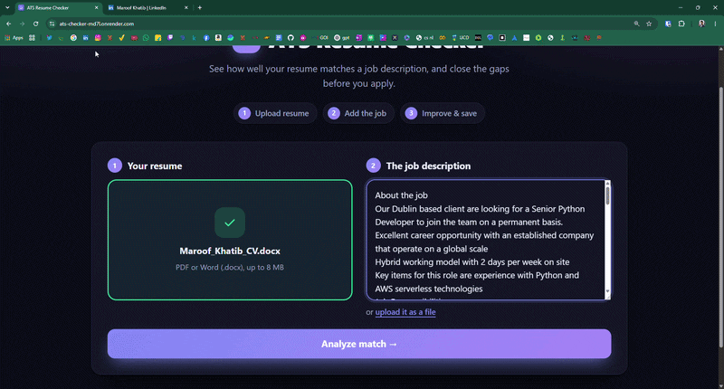

Upload a resume (PDF or DOCX), paste a job description, and see how well they match: a score out of 100, the skills the job wants that your resume is missing, and one click to add the ones you genuinely have and re-score. If you upload a Word file, you get your own document back with your original design, photo and fonts untouched.

**Live demo:** <https://ats-checker-md7l.onrender.com> (free hosting: the first load after a quiet period can take about 30 seconds)

<!-- Add docs/demo.gif here once recorded:    Script: docs/DEMO_SCRIPT.md -->

> The score is a resume-to-job-description match estimate, not a simulation of any specific ATS. Real systems (Workday, Greenhouse, Lever, ...) keep their rules private and differ from each other.

## What it does

- **Match score** from skills (50%), experience (25%), education (10%) and ATS-friendly formatting (15%), with a breakdown and prioritised suggestions.
- **Understands implied skills.** A resume that mentions LSTMs and autoencoders is credited for Deep Learning; DCF valuation implies Financial Modeling; month-end close implies Accounting. This uses a hand-built skill graph, plus an optional Claude Haiku 4.5 step for what the graph can't resolve (it must quote evidence from the resume, and the quote is verified).
- **Adds missing skills for you.** Tick the skills you really have, re-score, and compare before and after. Nothing is added unless you tick it.
- **Keeps your CV's design.** For an uploaded `.docx` only the Skills text is edited inside the file's XML; every other part (images, fonts, tables, headers) is carried over byte for byte, and tests check that.
- **Reads real-world files.** PDFs are read by position rather than by file order, so multi-column layouts and right-aligned dates come out in the right order. Dates written with any dash, month format, or "Present / Till date" are understood.
- **Choose where to save** with the system "Save as" window (Chrome/Edge).
- Fields covered: software, data/ML, cloud/DevOps, finance and operations (~235 skills).

## Quality and testing

- 52 automated tests (`npm test`): scoring, skill insertion, DOCX in-place editing, PDF reading order, date and experience parsing, and the optional login switch.
- `npm run eval` compares keyword-only matching, the skill graph, and graph + Claude on 48 labelled cases. Results from the last run:

  | Method                   | Precision | Recall |
  | ------------------------ | --------- | ------ |
  | Skill graph              | 100%      | 93.9%  |
  | Graph + Claude Haiku 4.5 | 97.5%     | 100%   |

  **Caveat:** the cases were written by the author while building the graph, so this is a regression suite that guards against breakage, not independent proof of accuracy.

## Privacy

Files are processed in memory and never stored. With the AI step enabled, resume text is sent to the Anthropic API for the skills the graph couldn't resolve; with `LLM_ENABLED=false` (or no API key) nothing leaves the server.

## How the score works

| Component      | Weight | What it checks                                                                                                                                 |
| -------------- | ------ | ---------------------------------------------------------------------------------------------------------------------------------------------- |
| Skills         | 50%    | ~190 known skills (with aliases) found in the job description vs. the resume. "Required" skills count fully, "nice to have" skills count half. |
| Experience     | 25%    | Years required in the job description vs. years from your resume's date ranges (overlaps merged) or stated "X years of experience".            |
| Education      | 10%    | Degree level required vs. degree level found.                                                                                                  |
| ATS formatting | 15%    | Contact info, section headings, length, quantified results, action verbs.                                                                      |

If the job description doesn't mention a component (e.g. no years required), it is left out and the others are re-weighted. The score is a heuristic estimate; real ATS systems vary.

## Run locally

Requires [Node.js](https://nodejs.org) 18+.

```bash
npm install
npm start
```

Open http://localhost:3000. Set `PORT` to use a different port.

## Run with Docker

```bash
docker build -t ats-checker .
docker run -p 7860:7860 ats-checker
```

Open http://localhost:7860.

## Deploy on Render (free tier)

Create a **Web Service** from this repo (Docker or Node). Set `NODE_ENV=production`. Optionally add `ANTHROPIC_API_KEY` and `AI_DAILY_LIMIT` for the AI step; see the warning under "Login is currently switched off" about public sites and API keys. The free tier sleeps when idle, so the first request after a quiet period is slow.

## Add missing skills to your CV

After a check, the "Add missing skills to your CV" card lists the skills the job wants that your resume lacks. Tick only the ones you genuinely have (or use **Select all**), then click **Add selected skills & re-score**: they are added to your resume's Skills section (or a new one) and the new score is shown next to the original. **Download updated CV (DOCX)** exports the same updated resume. Nothing is added unless the user ticks it. There is no editable text box; the resume text is kept in memory on the page. `npm test` covers the insertion logic and the export.

### Choosing where to save

In Chrome and Edge the save buttons open the system "Save as" window (File System Access API), so the user picks the folder and file name; the file is only built after a location is chosen, and closing the window cancels cleanly. This needs HTTPS or localhost, which Render and local development both provide. Firefox and Safari don't support it, so they get a normal download (those browsers have a setting to ask where to save every file).

### Keeping your own Word design

If the uploaded resume is a **.docx**, **Save my original CV with the new skills** returns the user's own file with only the new skills added. A .docx is a zip of XML parts; the server (`lib/docxedit.js`) finds the Skills section, appends the skills to the matching sub-group (e.g. tools vs. team skills) using the list's own separator (`,`, `•`, ...) and the formatting of the text it extends, or adds new bullets / a new Skills section styled like the existing headings. Every other part of the file (photo, fonts, styles, tables, text boxes, headers) is carried over byte-for-byte; tests check this. The file is processed in memory and not stored.

If no safe place can be found, or the upload is a PDF (which has no editable structure), the site falls back to the restyled document below and says so.

### Resume export

**Save restyled CV (DOCX)** rebuilds the resume as a polished, single-column, ATS-friendly Word document in one of three styles (Modern, Classic, Minimal). The text is first parsed into name, contact line, summary, jobs/education with right-aligned dates, bullets, and labelled skills, then rendered with real Word styling. The original PDF/Word file's own layout is not preserved. Parsing is heuristic, so unusual layouts may be arranged differently.

## Login is currently switched off

By default the site has **no login**: it opens straight to the checker and anyone can use it. All the account code is still in the repo and is switched on with one setting:

```bash
AUTH_ENABLED=true npm start     # or set AUTH_ENABLED=true in .env / your host's environment
```

With it off, the database and email modules are never loaded (no `data/` folder is created), `/login.html` redirects to the main page, and the account endpoints do not exist. Visitors are told apart by IP address, which the per-user AI limit and the rate limits use. **If you set `ANTHROPIC_API_KEY` while login is off, anyone who finds the site can trigger AI calls on your key** (limited by `AI_DAILY_LIMIT` per IP and the rate limiter); keep that in mind before making the site public.

## Accounts & login (only when `AUTH_ENABLED=true`)

Users sign up / sign in on `/login.html`; the checker and `/api/analyze` require a session.

- **Storage:** accounts live in a SQLite database (`data/app.db`, via better-sqlite3). Passwords are salted scrypt hashes, never plain text. An older `data/users.json` is imported automatically on first start and kept as `users.json.migrated`.
- **Sessions:** signed HttpOnly cookie valid for 7 days, so users stay logged in. Set `SESSION_SECRET` so sessions survive restarts.
- **Delete account:** button in the header; requires the password.
- **Forgot password:** emails a one-hour, single-use reset link (only its hash is stored). The response is identical whether or not the email exists. Resetting signs out all existing sessions.
- **Validation and headers:** request bodies are validated with zod; helmet sets security headers (CSP, nosniff, HSTS in production). Login/signup/reset are rate-limited per IP.
- Set `NODE_ENV=production` when serving over HTTPS (enables HSTS and `upgrade-insecure-requests`).

### Sending reset emails (nodemailer)

Example for Gmail with an [app password](https://myaccount.google.com/apppasswords):

```bash
SMTP_HOST=smtp.gmail.com
SMTP_PORT=465
SMTP_USER=you@gmail.com
SMTP_PASS=your-app-password
MAIL_FROM="ATS Checker <you@gmail.com>"
APP_URL=https://your-site.example.com   # base URL used in the reset link
```

Port 465 uses TLS; other ports use STARTTLS. If `SMTP_HOST` is not set, no email is sent and the reset link is printed to the server console instead (handy for local development). Set `APP_URL` in production so links don't depend on the request's Host header.

### Persisting accounts

The database lives in `data/`. With Docker, mount a volume or accounts are lost when the container is removed:

```bash
docker run -d -p 7860:7860 -v ats-data:/app/data ats-checker
```

On hosts without persistent disk (Render free, Hugging Face Spaces) accounts are lost on redeploy/restart.

## Fields covered

The skill dictionary (`lib/skills.js`, ~235 skills) and the "implies" graph (`lib/implications.js`) cover **software, data/ML, cloud/DevOps, finance and operations**. For example: DCF valuation implies Financial Modeling and Financial Analysis; month-end close and reconciliations imply Accounting; SAP implies ERP; warehouse management implies Logistics and Supply Chain; Lean Six Sigma implies Process Improvement. Other fields (healthcare, marketing, law, ...) still get keyword matching, plus the AI step for skills it can read from the job description. To add a field: add skills to `lib/skills.js`, links to `lib/implications.js`, and labelled cases to `tests/cases.js`, then run `npm run eval`.

## AI skill inference (optional)

Skills are matched by keywords, then by a skill graph that infers implied skills (e.g. LSTM and autoencoders imply Deep Learning). If `ANTHROPIC_API_KEY` is set (put it in a git-ignored `.env`), Claude Haiku 4.5 is also asked about job skills that are still unmatched, and must quote evidence from the resume. If the API is unavailable the app falls back to the graph.

- `AI_DAILY_LIMIT` (default 20) caps AI-assisted checks per user per day; `LLM_MODEL` changes the model; `LLM_ENABLED=false` turns it off.
- Resume text is sent to the Anthropic API when this is enabled. Say so in your privacy notice.
- `npm run eval` scores keyword-only vs graph vs AI on the labelled cases in `tests/cases.js` (the AI row makes real API calls).

## Notes

- Supported inputs: PDF, DOCX, TXT (max 8 MB). Legacy `.doc` is not supported — save as DOCX or PDF.
- Scanned/image-only PDFs have no extractable text and are rejected.
- Files are processed in memory and never stored.
- To add or change recognised skills, edit `lib/skills.js`.

## Project layout

```
server.js        Express server, file upload and text extraction
lib/analyzer.js  Scoring engine
lib/skills.js    Skill dictionary
lib/implications.js  Skill graph: which skills imply others
lib/skillgraph.js    Inference over that graph
lib/llm.js       Optional Claude skill inference
lib/auth.js      Sessions, passwords, reset tokens
lib/db.js        SQLite schema + legacy import
lib/mailer.js    nodemailer wrapper
lib/schemas.js   zod request validation
lib/cv.js        DOCX export
public/cvedit.js Inserts skills into the resume text (also unit-tested in Node)
tests/           Labelled evaluation cases and runner
public/          Front end (HTML, CSS, JS)
samples/         Example resume and job description
```
